# Modelo Relacional de AppiFood (Completo)

Este documento detalla la arquitectura de datos completa de la plataforma **AppiFood**, incluyendo las entidades de interacción social, promociones y fidelización.

```mermaid
erDiagram
    %% Usuarios y Seguridad
    USER {
        bigint id PK
        string name
        string email UK
        enum role "admin, restaurant, user"
        boolean status
        boolean is_premium
    }
    ADDRESS {
        bigint id PK
        bigint user_id FK
        string address_line
        decimal lat
        decimal lng
    }
    USER_PAYMENT_METHOD {
        bigint id PK
        bigint user_id FK
        string provider
        string last_four
    }

    %% Restaurantes y Menú
    RESTAURANT {
        bigint id PK
        bigint user_id FK
        string name
        decimal average_rating
        decimal delivery_cost
        boolean is_active
    }
    RESTAURANT_CATEGORY {
        bigint id PK
        string name
    }
    RESTAURANT_SCHEDULE {
        bigint id PK
        bigint restaurant_id FK
        string day_of_week
        time open_time
        time close_time
    }
    DELIVERY_ZONE {
        bigint id PK
        bigint restaurant_id FK
        string zone_name
        decimal delivery_fee
    }
    PRODUCT {
        bigint id PK
        bigint restaurant_id FK
        bigint category_id FK
        string name
        decimal price
        boolean is_available
    }
    CATEGORY {
        bigint id PK
        bigint restaurant_id FK
        string name
    }

    %% Órdenes y Carrito
    SHOPPING_CART {
        bigint id PK
        bigint user_id FK
        bigint restaurant_id FK
    }
    CART_ITEM {
        bigint id PK
        bigint shopping_cart_id FK
        bigint product_id FK
        integer quantity
    }
    ORDER {
        bigint id PK
        bigint user_id FK
        bigint restaurant_id FK
        bigint coupon_id FK
        string status
        decimal total
    }
    ORDER_ITEM {
        bigint id PK
        bigint order_id FK
        bigint product_id FK
        integer quantity
        decimal unit_price
    }
    ORDER_TRACKING {
        bigint id PK
        bigint order_id FK
        string status
    }

    %% Fidelización e Interacción
    COUPON {
        bigint id PK
        bigint restaurant_id FK
        string code UK
        decimal discount
        date expires_at
    }
    REVIEW {
        bigint id PK
        bigint user_id FK
        bigint restaurant_id FK
        integer rating
        text comment
    }
    FAVORITE {
        bigint id PK
        bigint user_id FK
        bigint restaurant_id FK
    }
    NOTIFICATION {
        bigint id PK
        bigint user_id FK
        string title
        text message
        boolean is_read
    }
    BANNER {
        bigint id PK
        string image_url
        string link_url
    }

    %% Suscripciones
    SUBSCRIPTION_PLAN {
        bigint id PK
        string name
        decimal monthly_price
    }
    USER_SUBSCRIPTION {
        bigint id PK
        bigint user_id FK
        bigint subscription_plan_id FK
        date start_date
        date end_date
    }

    %% Relaciones
    USER ||--o{ ADDRESS : "registra"
    USER ||--o{ ORDER : "realiza"
    USER ||--o{ SHOPPING_CART : "posee"
    USER ||--o{ REVIEW : "escribe"
    USER ||--o{ FAVORITE : "guarda"
    USER ||--o{ NOTIFICATION : "recibe"
    USER ||--o{ USER_SUBSCRIPTION : "se suscribe"
    
    RESTAURANT ||--o{ PRODUCT : "ofrece"
    RESTAURANT ||--o{ ORDER : "recibe"
    RESTAURANT ||--o{ DELIVERY_ZONE : "cubre"
    RESTAURANT ||--o{ COUPON : "emite"
    RESTAURANT ||--o{ CATEGORY : "organiza"
    RESTAURANT }o--o{ RESTAURANT_CATEGORY : "clasificado en"

    PRODUCT ||--o{ ORDER_ITEM : "se incluye en"
    PRODUCT ||--o{ CART_ITEM : "se añade a"
    
    ORDER ||--|{ ORDER_ITEM : "contiene"
    ORDER ||--o{ ORDER_TRACKING : "se rastrea"
    ORDER ||--o{ PAYMENT : "se liquida"

    SHOPPING_CART ||--|{ CART_ITEM : "contiene"
    
    SUBSCRIPTION_PLAN ||--o{ USER_SUBSCRIPTION : "define"
```

## Resumen de Funcionalidades por Módulo

### Módulo de Clientes
- **Direcciones y Pagos:** Los clientes pueden gestionar múltiples puntos de entrega y métodos de pago para agilizar su experiencia.
- **Social:** El sistema de `Reviews` y `Favorites` fomenta la confianza y permite al usuario personalizar su feed.
- **Notificaciones:** Centraliza alertas de estado de pedido y promociones.

### Módulo de Restaurantes
- **Logística Dinámica:** `DeliveryZones` permite definir costos de envío variables y `RestaurantSchedules` controla cuándo el restaurante está visible.
- **Marketing:** Los `Coupons` y `Banners` son herramientas para que los restaurantes (o el administrador global) impulsen ventas.

### Módulo de Pedidos y Transacciones
- **Consistencia de Datos:** `OrderItems` almacena el precio del producto en el momento exacto de la compra (`unit_price`), protegiendo la integridad financiera ante cambios de precio futuros en el catálogo.
- **Rastreo:** `OrderTracking` guarda el historial de estados por los que pasa un pedido, permitiendo mostrar una línea de tiempo al usuario.

### Módulo Premium
- **Suscripciones:** `SubscriptionPlan` y `UserSubscription` gestionan el acceso a beneficios exclusivos (ej: envíos gratis, descuentos mayores), lo cual se refleja en el campo `is_premium` del usuario.

---
> [!IMPORTANT]
> Las llaves foráneas y restricciones de integridad están configuradas con `onDelete('cascade')` en la mayoría de los casos para asegurar que, si se elimina un restaurante o usuario, sus datos relacionados no dejen registros huérfanos.

